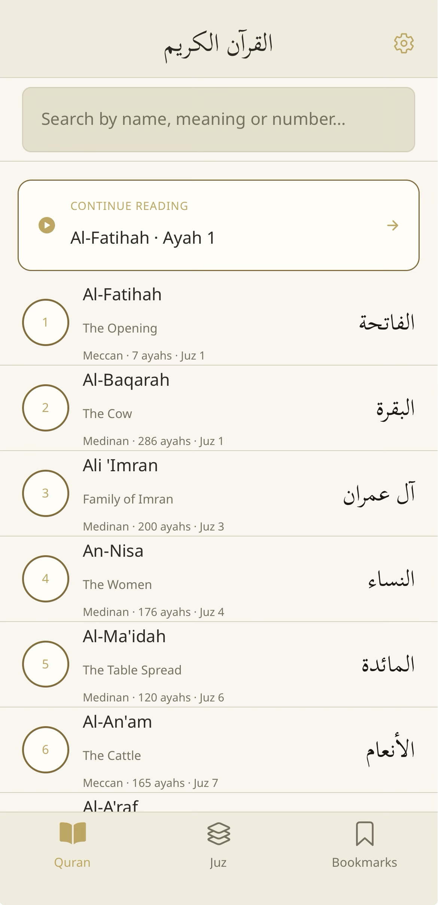
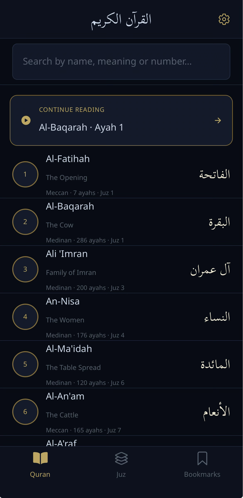
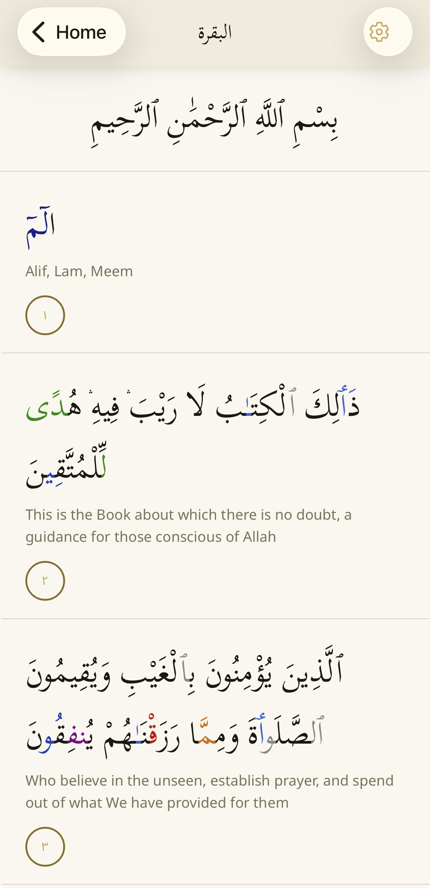
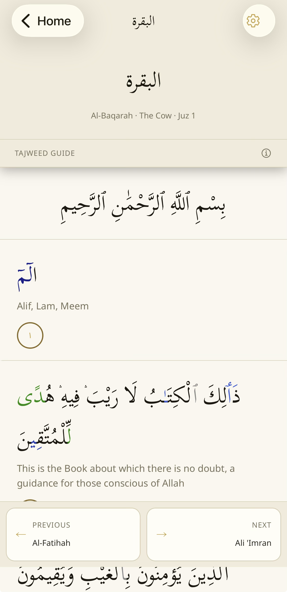
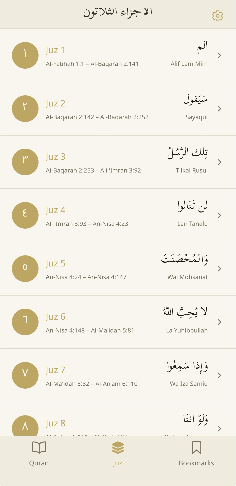
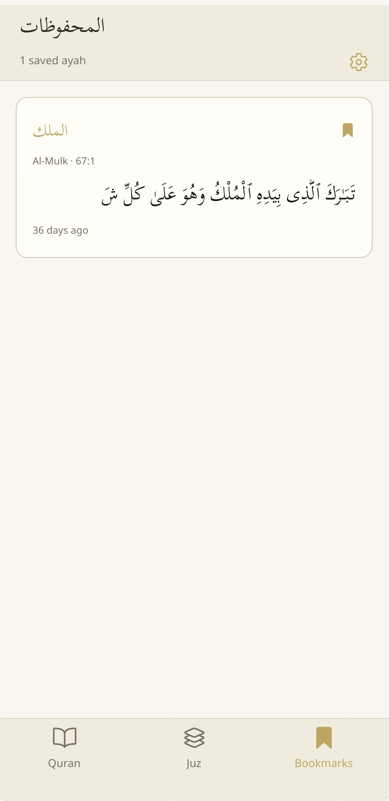
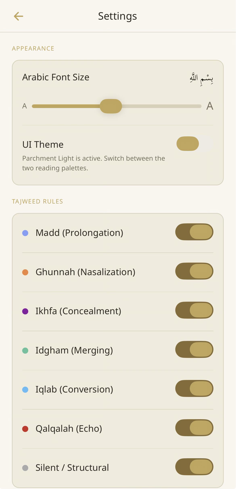
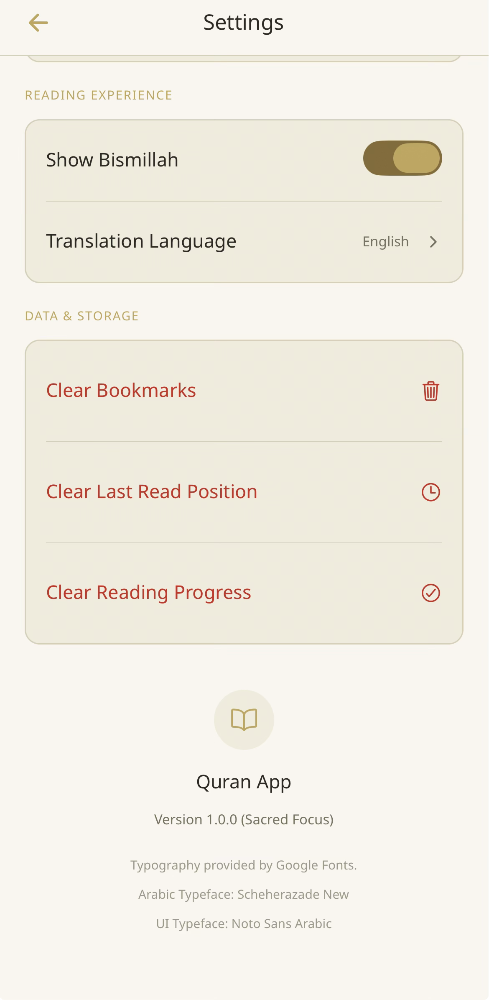
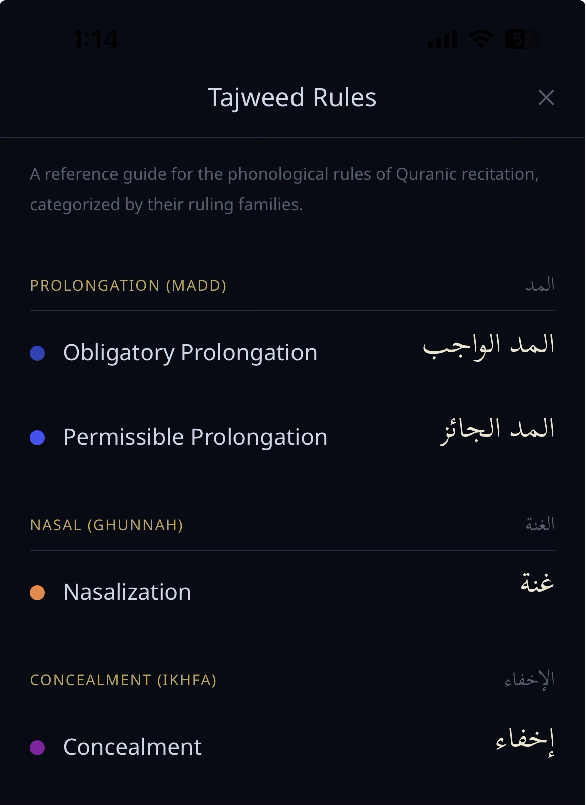
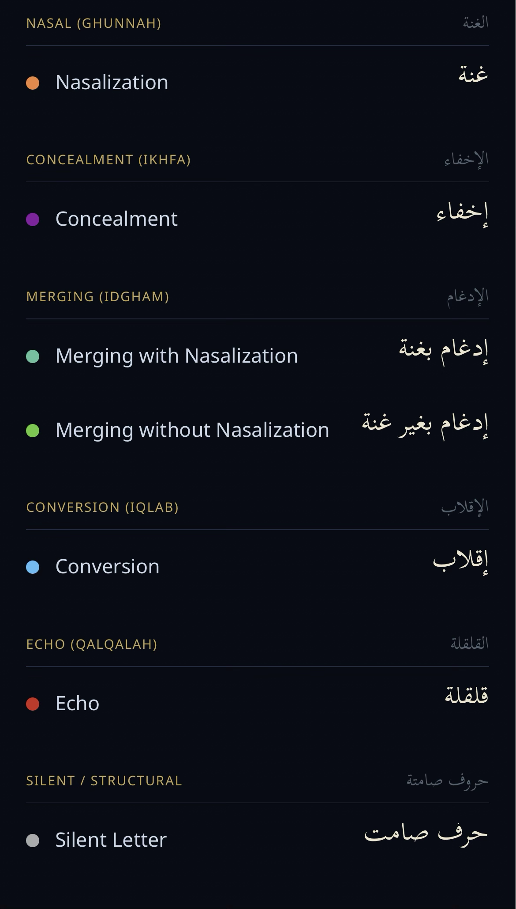

# Quran Reader

A clean, offline-capable Arabic Quran reader built with React Native and Expo. Designed for focused, distraction-free reading with full Tajweed color support and RTL layout.

---

## 📸 Screenshots

>

| Home (Light) | Home (Dark) | Surah View |
|--------------|-------------|------------|
|  |  |  |

| Surah Details | Juz List | Bookmarks |
|---------------|----------|-----------|
|  |  |  |

| Settings – Appearance | Settings – Reading & Data |
|-----------------------|---------------------------|
|  |  |

| Tajweed Rules – Part 1 | Tajweed Rules – Part 2 |
|------------------------|------------------------|
|  |  |

> *All 10 screenshots show the app with Tajweed colour coding, RTL layout, and the dark/light theme options.*

---

## Features

- **Tajweed coloring** — rules rendered inline using `rn-tajweed-verse` so every tajweed rule is visually marked without cluttering the text
- **RTL-first layout** — proper right-to-left rendering for Arabic text using `I18nManager`
- **Multiple Arabic fonts** — Scheherazade New, Noto Sans Arabic, and Literata Bold; user can switch between them
- **Bookmarks & reading progress** — jump back to exactly where you left off, across surahs
- **Dark / Light theme** — persistent theme preference stored locally; status bar adapts automatically
- **Data integrity check** — on launch, `verifyIntegrity()` validates all surah data against expected checksums and warns in dev mode if anything is missing or corrupted
- **Error boundary** — catches unexpected crashes gracefully and lets the user resume without losing progress
- **Fully offline** — all Quran data is bundled at build time; no network requests at runtime

---

## Tech Stack

| Layer | Choice |
|---|---|
| Framework | React Native 0.81 + Expo SDK 54 |
| Language | TypeScript |
| Navigation | React Navigation v7 (Native Stack + Bottom Tabs) |
| Quran data | `quran-json` |
| Tajweed rendering | `rn-tajweed-verse` |
| Fonts | `expo-font` (Scheherazade New, Noto Sans Arabic, Literata Bold) |
| Storage | `@react-native-async-storage/async-storage` |
| Gestures | `react-native-gesture-handler` |

---

## Getting Started

### Prerequisites

- Node.js 18+
- Expo CLI: `npm install -g expo-cli`
- Expo Go app on your phone **or** a simulator

### Install & Run

```bash
git clone https://github.com/amajid17/Quran-reader.git
cd quran-reader
npm install
npx expo start
```

Scan the QR code with Expo Go (iOS / Android) to run instantly on your device.

### Build for Production

```bash
npx eas build --platform ios
npx eas build --platform android
```

Requires an [Expo EAS](https://expo.dev/eas) account (free tier is sufficient).

---

## Project Structure

```
quran-reader/
├── App.tsx                   # Root: error boundary, fonts, theme, navigator
├── app.json                  # Expo config (bundle IDs, splash, orientation)
├── index.ts                  # Entry point
├── babel.config.js
├── metro.config.js
├── tsconfig.json
├── package.json
├── assets/
│   └── fonts/                # Bundled Arabic & Latin fonts
├── scripts/
└── src/
    ├── navigation/
    │   └── AppNavigator.tsx  # Stack + tab structure
    ├── theme/
    │   └── ThemeContext.tsx  # Dark/light mode provider + useTheme hook
    └── data/
        └── integrityCheck.ts # Validates bundled Quran data at startup
```

---

## Architecture Notes

**Fonts** — Loaded at startup via `expo-font`; splash screen is held open until fonts resolve, preventing a flash of unstyled Arabic text.

**Theme** — A React context wraps the entire tree. `ThemedStatusBar` is a small dedicated component inside the provider so it can call `useTheme()` without breaking the class-based `ErrorBoundary` above it.

**Integrity check** — Runs once after fonts are ready. In development, any checksum mismatch logs which surahs failed and points to the download script. In production, this check is silent to avoid alarming users over minor data discrepancies.

**Error boundary** — If a screen crashes, the boundary catches it, logs the component stack in dev, and shows a recovery screen with a "Try again" button. Bookmarks and reading progress (stored externally in AsyncStorage) are unaffected.

---

## License

MIT
